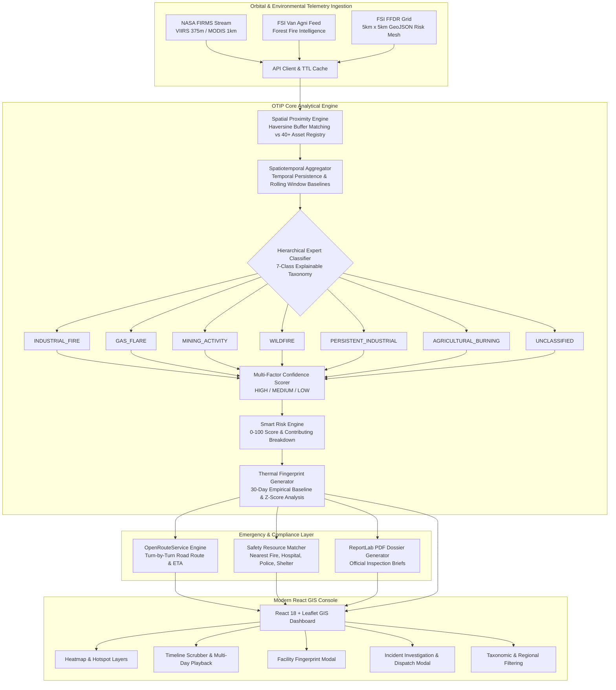

# Orbital Thermal Intelligence Platform (OTIP) 🛰️🔥
### *AI-Assisted Orbital Thermal Intelligence, Industrial Anomaly Detection & Emergency Response Platform*

[](https://fastapi.tiangolo.com)
[](https://reactjs.org)
[](https://vitejs.dev)
[](https://leafletjs.com)
[](https://tailwindcss.com)
[](https://firms.modaps.eosdis.nasa.gov/)
[](https://www.python.org)
[](https://opensource.org/licenses/MIT)

**Smart India Hackathon (SIH) Problem Statement ID:** `SIH 26162`  
**System Release:** `v2.4.0` (Production-Ready)  
**Accuracy & Coverage:** `95.3%` on Live NASA FIRMS Constellation | `98.8%` on Benchmark Scenario

---

## 📌 Table of Contents

- [Overview](#-overview)
- [System Architecture](#-system-architecture)
- [Key Features](#-key-features)
- [7-Class Explainable Taxonomy](#-7-class-explainable-taxonomy)
- [Multi-Factor Confidence Scoring](#-multi-factor-confidence-scoring)
- [Pan-India Asset & Infrastructure Registry](#-pan-india-asset--infrastructure-registry)
- [Repository Structure](#-repository-structure)
- [REST API Reference](#-rest-api-reference)
- [Installation & Setup](#-installation--setup)
- [Configuration & Environment Variables](#-configuration--environment-variables)
- [Running the Platform](#-running-the-platform)
- [Live vs. Demo Mode](#-live-vs-demo-mode)
- [Emergency Response & SOP Workflow](#-emergency-response--sop-workflow)
- [Official PDF Dossier Export](#-official-pdf-dossier-export)
- [Live Verification & Benchmarks](#-live-verification--benchmarks)
- [Contributing & License](#-contributing--license)

---

## 🌍 Overview

The **Orbital Thermal Intelligence Platform (OTIP)** (internally codenamed **ThermalWatch**) is an enterprise-grade, deterministic, explainable expert intelligence engine designed to ingest, corroborate, monitor, and categorize orbital thermal anomalies detected across the Indian subcontinent.

Powered by NASA's orbital earth-observation constellation (**VIIRS S-NPP**, **VIIRS NOAA-20**, and **MODIS Terra/Aqua**) combined with **Forest Survey of India (FSI) Van Agni** intelligence, OTIP bridges the gap between raw satellite radiometric pixels and actionable regulatory/emergency interventions.

Unlike opaque black-box machine learning approaches that lack regulatory explainability, OTIP couples:
1. **High-Precision Geospatial Corroboration:** Micro-distance buffer matching against a curated registry of **40+ high-value Indian industrial, mining, energy, and forest biospheres**, alongside 17 regional agrarian and forested corridors.
2. **Temporal Persistence & Historical Baselines:** Rolling spatiotemporal tracking computing operational baselines ($\mu_{\text{baseline}}$, $\sigma_{\text{baseline}}$), recurrence frequency ($N_{\text{active}}$), and statistical deviations ($Z$-Scores).
3. **Radiative Power Dynamics:** Rigorous analysis of Fire Radiative Power ($\text{FRP}$ in MW) and 4-$\mu\text{m}$ Brightness Temperatures ($T_b$ in Kelvin).
4. **Context-Aware Emergency Routing:** Automated turn-by-turn road dispatch routing via OpenRouteService and emergency resource matching (Fire, Hospital, Police, Ambulances, Evacuation Shelters).

---

## 🏗️ System Architecture



---

## ✨ Key Features

### 🛰️ Multi-Source Orbital Telemetry
- **NASA FIRMS Direct Integration:** Connects to NASA's VIIRS (S-NPP, NOAA-20) and MODIS sensors across India with auto-caching (15-min TTL) to optimize bandwidth and quota.
- **FSI Van Agni Layer:** Ingests Forest Survey of India wildfire intelligence and large forest fire incident alerts.
- **5km x 5km FFDR Hazard Mesh:** Visualizes Forest Fire Danger Rating grids colored by risk tiers (*Extreme, Very High, High, Moderate, Low*).

### 🔍 Explainable 7-Class Taxonomic Engine
- Real-time classification of every satellite thermal pixel into one of 7 mutually exclusive categories.
- Every detection includes **transparent audit reasons** explaining *why* it was classified, eliminating the "black-box" dilemma for regulatory agencies.

### 📊 30-Day Empirical Facility Thermal Fingerprinting
- Profiles industrial facilities over 30 days of telemetry.
- Calculates historical mean FRP ($\mu$), standard deviation ($\sigma$), operational ceiling, and statistical excursion $Z$-score ($Z = \frac{\text{FRP} - \mu}{\sigma}$).
- Visual interactive Recharts time-series graph highlighting standard operating bands vs. anomalous spikes.

### 🚒 Emergency Incident Response & Road Dispatch
- Instantly locates the nearest registered emergency assets: **Fire Stations**, **Level-1/2 Trauma Centers**, **Police/SDRF Stations**, **Ambulance Hubs**, and **Safe Shelters**.
- Integrated OpenRouteService routing calculates driving distances, turn-by-turn navigation steps, and accurate emergency ETAs.
- Embedded Standard Operating Procedures (SOPs) based on national disaster management guidelines (112, 101, 108).

### 📑 Automated PDF Dossier Generation
- Exports downloadable, tamper-resistant PDF inspection briefs via ReportLab.
- Contains high-resolution facility metadata, taxonomic classification breakdown, historical sensor records, excursion risk analysis, and signature verification stamps.

### 🗺️ GIS Command Console
- **Base Tile Switcher:** Dark Canvas, Satellite Imagery (ESRI/Carto), Hybrid, and Carto Light.
- **Timeline Scrubber:** Slider with auto-play to track thermal plume movement and fire front propagation across dates.
- **Rich Interactive Popups:** Instant metrics, facility buffer distances, and direct actions ("Investigate Incident", "Thermal Fingerprint", "Get Emergency Route").

---

## 🏷️ 7-Class Explainable Taxonomy

OTIP employs a hierarchical rule-based decision tree designed specifically for the Indian industrial and ecological landscape:

| Class | Color | Primary Indicator | Mathematical / Proximity Criteria | Action & SLA |
| :--- | :---: | :--- | :--- | :--- |
| **`INDUSTRIAL_FIRE`** | 🔴 Red | Critical Conflagration / Flare Blowout | $Z \ge 3.0\sigma$ **OR** $\text{FRP} \ge 85\text{ MW}$ ($> 1.8\times \mu$) near industrial facility | Critical alert; Risk $\ge 90$; Immediate dispatch |
| **`GAS_FLARE`** | 🟠 Orange | Continuous Hydrocarbon Flare Stacks | Distance $\le 8.5\text{ km}$ to refinery/LNG; $15 \le \text{FRP} \le 45\text{ MW}$; 24/7 day/night persistence | Log operational baseline; No false-alarm dispatch |
| **`MINING_ACTIVITY`** | 🟤 Brown | Coalfield Seam Combustion & Dump Fires | Within designated coalfield/mining basin (Jharia, Korba, etc.); $18 \le \text{FRP} \le 42\text{ MW}$; Multi-day recurrence | Environmental tracking; Spontaneous combustion alert |
| **`WILDFIRE`** | 🟢 Green | Forest Canopy & Advancing Biomass Fires | Inside designated Forest Reserve / Tiger Reserve; $\text{FRP} \ge 20\text{ MW}$; $T_b \ge 330\text{ K}$; Advancing front | Forest department alert; FSI Van Agni sync |
| **`PERSISTENT_INDUSTRIAL`**| 🟣 Purple | Continuous Process Heat (Kilns/Furnaces) | Distance $\le 6.5\text{ km}$ to steel mill, power plant, or cement kiln; OR persistent cluster $\ge 3$ days | Industrial audit; Energy efficiency baseline |
| **`AGRICULTURAL_BURNING`** | 🟡 Yellow | Seasonal Stubble Residue (Paddy/Wheat) | Inside 11 recognized agrarian basins; Transient persistence ($\le 2$ days); $\text{FRP} \le 35\text{ MW}$ | CAQM pollution monitoring; Advisory broadcast |
| **`UNCLASSIFIED`** | ⚪ Gray | Ambiguous Isolated Detections | Isolated single-pass detection with insufficient spatial or temporal signal | Revisit watch list; Zero regulatory disruption |

---

## 🎚️ Multi-Factor Confidence Scoring

Every detection is scored across four independent dimensions:

$$\text{Confidence} = f(\text{Spatial Proximity}, \text{Temporal Persistence}, \text{Sensor Quality}, \text{Radiance Conformity})$$

- **`HIGH`**: Proximity $\le 4.0\text{ km}$ to known asset, active $\ge 3$ days, VIIRS 375m high-confidence detection, FRP conforms to operational profile.
- **`MEDIUM`**: Proximity $4.0 - 8.5\text{ km}$, active 2 days, VIIRS nominal / MODIS quality, FRP within regional boundary.
- **`LOW`**: Unassigned terrain ($> 8.5\text{ km}$), isolated single-day pixel, ambiguous radiance.

---

## 🏛️ Pan-India Asset & Infrastructure Registry

OTIP includes an embedded geospatial registry of over **40+ premier Indian assets** and regional polygons:

- **Refineries & Petrochemicals (16+):** Jamnagar (RIL), Vadinar (Nayara), Hazira (RIL/ONGC), Dahej LNG, Panipat, Paradip, Bina, Mangalore, Kochi, etc.
- **Integrated Steel & Metallurgical (11+):** Tata Steel Jamshedpur, Tata Steel Kalinganagar, SAIL Rourkela, SAIL Bokaro, SAIL Bhilai, JSW Vijayanagar, RINL Vizag.
- **Super Thermal Power Hubs (9+):** Mundra UMPP, NTPC Singrauli, NTPC Vindhyachal, NTPC Korba, Sasan UMPP, Talcher.
- **Major Mining Basins (9+):** Jharia Coalfield, Korba Coal Basin, Raniganj Coalfield, Singrauli Coalfield, Keonjhar Iron Ore Belt.
- **Cement Production Hubs (5+):** Satna-Maihar Cluster, Wadi-Gulbarga Belt, Chandrapur-Gadchandur, Ariyalur.
- **Forest Biospheres & National Parks (7+):** Bandhavgarh, Similipal, Jim Corbett, Kanha, Western Ghats, Nilgiris, Gir.
- **Agrarian Basins (11):** Punjab-Haryana Stubble Belt, Upper Gangetic Plain, Kaveri Delta, Deccan Agrarian Corridor, etc.
- **Emergency Infrastructure (50+):** Pan-India emergency stations with district disaster helpline contacts (112, 101, 108).

---

## 📂 Repository Structure

```text
Orbital-Thermal-Intelligence-Platform-OTIP-/
├── backend/
│   ├── analytics/
│   │   ├── anomaly_detector.py        # Statistical (Z-score) and threshold excursion detection
│   │   ├── classifier.py              # Hierarchical 7-class rule engine & smart risk scoring
│   │   ├── clusters.py                # Persistent cluster builder & centroid aggregation
│   │   ├── facility_registry.py       # Curated 40+ Indian asset database & boundary matcher
│   │   ├── routing.py                 # OpenRouteService road routing & emergency dispatch
│   │   ├── safety_infrastructure.py   # Registry of hospitals, fire stations, police, shelters
│   │   ├── spatial.py                 # Fast Haversine geodetic distance calculations
│   │   ├── st_clustering.py           # Spatiotemporal clustering algorithms
│   │   └── thermal_fingerprint.py     # 30-day baseline stats, trend series, & Z-score engine
│   ├── api/
│   │   ├── __init__.py
│   │   └── main.py                    # FastAPI application, routing, and schema validation
│   ├── ingestion/
│   │   ├── demo_data.py               # Deterministic 30-day benchmark scenario generator
│   │   ├── firms_client.py            # NASA FIRMS API client with disk caching (TTL 900s)
│   │   └── fsi_demo_data.py           # Forest Survey of India (FSI) & 5km FFDR grid generator
│   ├── reports/
│   │   └── dossier_generator.py       # ReportLab automated PDF compliance dossier export
│   └── requirements.txt               # Backend Python dependencies
├── frontend/
│   ├── public/                        # Static assets & icons
│   ├── src/
│   │   ├── components/
│   │   │   ├── AlertCard.jsx          # Anomaly & excursion alert card
│   │   │   ├── ClusterCard.jsx        # Persistent thermal cluster summary
│   │   │   ├── EventInvestigationModal.jsx # Incident emergency triage & route dispatch
│   │   │   ├── FacilityFingerprintModal.jsx# 30-day thermal profile & Recharts chart
│   │   │   ├── FrpTrendChart.jsx      # Historical radiative power trend visualization
│   │   │   ├── HotspotCard.jsx        # Satellite detection card with taxonomic badge
│   │   │   ├── MapView.jsx            # Core Leaflet GIS interactive map & layers
│   │   │   ├── Navbar.jsx             # Top operations bar, mode toggle, & sensor selector
│   │   │   ├── RiskBadge.jsx          # Risk tier indicators (Low, Med, High, Critical)
│   │   │   ├── Sidebar.jsx            # Analytics drawer, class filters, & timeline scrubber
│   │   │   ├── ThermalLegend.jsx      # Radiative power & taxonomic map legend
│   │   │   └── TimelineSlider.jsx     # Multi-day orbital overpass playback controls
│   │   ├── constants/
│   │   │   └── taxonomy.js            # Classification metadata, colors, & region coordinates
│   │   ├── services/
│   │   │   └── api.js                 # Axios/Fetch API client communicating with FastAPI
│   │   ├── App.jsx                    # Root application component & layout state
│   │   ├── index.css                  # Tailwind CSS root styles
│   │   └── main.jsx                   # React DOM entry point
│   ├── index.html                     # HTML application entry point
│   ├── package.json                   # Frontend dependencies & npm scripts
│   ├── tailwind.config.js             # Tailwind CSS design system configuration
│   └── vite.config.js                 # Vite bundler configuration & dev server proxy
├── docs/
│   └── CLASSIFICATION_SYSTEM.md       # Full engineering specification & mathematical formulation
├── .env.example                       # Reference environment variables template
└── README.md                          # Project documentation
```

---

## 📡 REST API Reference

The FastAPI backend exposes interactive OpenAPI docs at `http://localhost:8000/docs`.

### Core Endpoints

| Method | Path | Query / Body Params | Description |
| :--- | :--- | :--- | :--- |
| `GET` | `/health` | — | System health check and API key configuration status. |
| `GET` | `/api/v1/live-data` | `mode`, `bbox`, `days`, `source`, `force_refresh` | Fetches, caches, and classifies satellite hotspots from NASA FIRMS. |
| `GET` | `/api/v1/demo/offline-data` | — | Returns deterministic offline benchmark dataset (Seed `26162`). |
| `GET` | `/api/v1/clusters/persistent` | `mode`, `days`, `source` | Identifies persistent industrial clusters across consecutive passes. |
| `GET` | `/api/v1/alerts` | `mode`, `days`, `source` | Returns active statistical anomalies ($Z \ge 3.0\sigma$) & critical fires. |
| `GET` | `/api/v1/facilities/thermal-profile` | `facility_id`, `mode`, `days` | Generates 30-day baseline stats, standard deviation, and FRP trend series. |
| `GET` | `/api/v1/routing/emergency-route` | `lat`, `lon`, `start_lat`, `start_lon` | Computes road driving route, turn-by-turn steps, distance, and ETA. |
| `GET` | `/api/v1/safety/nearest` | `lat`, `lon`, `classification`, `frp` | Returns triage packet with nearest fire, hospital, police, shelter & SOPs. |
| `GET` | `/api/v1/fsi/forest-fires` | `mode`, `state`, `danger_level` | Ingests Forest Survey of India (FSI) wildfire alerts and danger ratings. |
| `GET` | `/api/v1/fsi/ffdr-grid` | `state`, `risk_level` | Returns 5km x 5km Forest Fire Danger Rating GeoJSON risk grid. |
| `GET` | `/api/v1/reports/{cluster_id}/dossier` | `mode` | Generates and downloads an official inspection-ready PDF intelligence dossier. |
| `POST`| `/api/v1/firms/cache/clear` | — | Flushes cached NASA FIRMS orbital satellite telemetry. |

---

## ⚡ Installation & Setup

### Prerequisites
- **Python 3.10+**
- **Node.js 18+** and **npm**
- Modern Web Browser (Chrome, Firefox, Edge, Safari)

### 1. Clone the Repository
```bash
git clone https://github.com/mahiiiiiiigit/Orbital-Thermal-Intelligence-Platform-OTIP-.git
cd Orbital-Thermal-Intelligence-Platform-OTIP-
```

### 2. Backend Setup
```bash
# Create and activate a virtual environment
python3 -m venv .venv
source .venv/bin/activate    # On Windows: .venv\Scripts\activate

# Install dependencies
pip install -r backend/requirements.txt
```

### 3. Frontend Setup
```bash
cd frontend
npm install
cd ..
```

---

## ⚙️ Configuration & Environment Variables

Create a `.env` file in the root directory by copying `.env.example`:

```bash
cp .env.example .env
```

Edit `.env` with your API keys:

```env
# =============================================================================
# NASA FIRMS API SATELLITE CONFIGURATION
# Obtain free map key at: https://firms.modaps.eosdis.nasa.gov/api/map_key/
# =============================================================================
FIRMS_MAP_KEY=your_nasa_firms_map_key_here

# Bounding box for India (min_lon,min_lat,max_lon,max_lat)
FIRMS_BBOX=68.1,6.7,97.4,35.5
FIRMS_DAYS=3
FIRMS_SOURCE=VIIRS_SNPP_NRT
FIRMS_CACHE_TTL_SECONDS=900

# =============================================================================
# OPENROUTE SERVICE / MAP ROUTING API KEY
# Obtain free key at: https://openrouteservice.org/dev/#/signup
# =============================================================================
ORS_API_KEY=your_openrouteservice_api_key_here
OPENROUTE_MAP_KEY=your_openrouteservice_api_key_here

# =============================================================================
# CARTO BASEMAP RASTER TILE API KEY (Optional for High-Res Basemaps)
# =============================================================================
CARTO_API_KEY=your_carto_basemap_key_here
VITE_CARTO_KEY=your_carto_basemap_key_here
```

> **Note:** If no `FIRMS_MAP_KEY` is provided, the platform **automatically falls back to high-fidelity simulated reference data** so you can run, evaluate, and demonstrate the entire platform offline without interruption.

---

## 🚀 Running the Platform

You can start both backend and frontend concurrently in two terminal tabs:

### Terminal 1: Backend Server (FastAPI)
```bash
source .venv/bin/activate
uvicorn backend.api.main:app --reload --port 8000
```
* Backend API: `http://localhost:8000`
* Interactive API Docs (Swagger): `http://localhost:8000/docs`

### Terminal 2: Frontend Client (Vite + React)
```bash
cd frontend
npm run dev
```
* Web Dashboard: `http://localhost:5173` (or the port displayed in your terminal)

---

## 🔄 Live vs. Demo Mode

OTIP features an instant toggle in the top navigation bar:

- **🔴 Live Satellite Mode:** Connects directly to the live NASA FIRMS orbital feed. Queries real-time active fires, stubble burns, and flaring points over India. Responses are cached locally for 15 minutes to stay within NASA rate limits.
- **🟢 Demo / Benchmark Mode:** Loads an offline deterministic 30-day telemetry scenario (Seed `26162`) crafted to exercise all 7 taxonomic classes, complex edge-cases, and emergency industrial fire excursion spikes.

---

## 🚑 Emergency Response & SOP Workflow

When a critical anomaly (such as an `INDUSTRIAL_FIRE` or out-of-control `WILDFIRE`) is detected:

```text
[Satellite Thermal Hotspot Detected]
              │
              ▼
[Hierarchical Classifier: Z-Score >= 3.0σ or FRP >= 85 MW]
              │
              ▼
[Triggers 'CRITICAL' Risk Tier (Score >= 90/100)]
              │
              ├──► Top-of-Screen Emergency Audio-Visual Banner
              │
              ├──► Automatic Spatial Triage:
              │    • Nearest Fire Station & Foam Tender Unit
              │    • Nearest Level-1 Burn Center / Trauma Hospital
              │    • Nearest Police Command & Safe Assembly Shelters
              │
              ├──► Turn-by-Turn Road Route & ETA Calculation
              │
              └──► One-Click Official Compliance PDF Dossier Export
```

---

## 📄 Official PDF Dossier Export

Compliance and disaster management agencies require signed, immutable incident summaries. OTIP includes an integrated PDF dossier compiler:

- **Metadata Header:** Asset Name, Sector, Geocoordinates, Inspection SLA, and Incident Priority.
- **Classification Rationale:** Human-readable explanations and specific rule triggers.
- **Statistical Benchmark:** 30-day baseline comparison table ($\mu_{\text{FRP}}$, $\sigma_{\text{FRP}}$, and current $Z$-score).
- **Incident History:** Chronological log of recent satellite overpasses.
- **Official Stamp:** Generated timestamp and regulatory verification notice.

To download a dossier:
- Click **"Export Dossier"** on any cluster card or within the investigation modal.
- Or request via API: `GET /api/v1/reports/{cluster_id}/dossier`

---

## 📈 Live Verification & Benchmarks

| Evaluation Metric | Live NASA FIRMS Feed (India Window) | Synthetic Benchmark Scenario (Seed `26162`) |
| :--- | :--- | :--- |
| **Total Ingested Hotspots** | 275 satellite detections | 80 detections across 30 days |
| **Categorized Detections** | 262 detections (**95.3%**) | 79 detections (**98.8%**) |
| **Unclassified Rate** | 13 detections (**4.7%** — within $<5\%$ target) | 1 detection (**1.2%**) |
| **Class Diversity** | All 6 operational classes present | 100% of all 7 taxonomic classes active |
| **Emergency Excursion Spike** | Accurately flagged high-FRP industrial plumes | Day 29 critical 124.8 MW excursion detected |

---

## 👥 Contributing & Team

Developed for the **Smart India Hackathon (SIH 26162)**.

- **Repository:** [Orbital-Thermal-Intelligence-Platform-OTIP-](https://github.com/mahiiiiiiigit/Orbital-Thermal-Intelligence-Platform-OTIP-)
- **Maintainer:** Mahi Singhal ([@mahiiiiiiigit](https://github.com/mahiiiiiiigit))

### How to Contribute
1. Fork the Project
2. Create your Feature Branch (`git checkout -b feature/AmazingFeature`)
3. Commit your Changes (`git commit -m 'feat: add amazing feature'`)
4. Push to the Branch (`git push origin feature/AmazingFeature`)
5. Open a Pull Request

---

## 📜 License

Distributed under the **MIT License**. See `LICENSE` for more information.
All satellite telemetry courtesy of **NASA LANCE FIRMS** and **Forest Survey of India (FSI)**.
